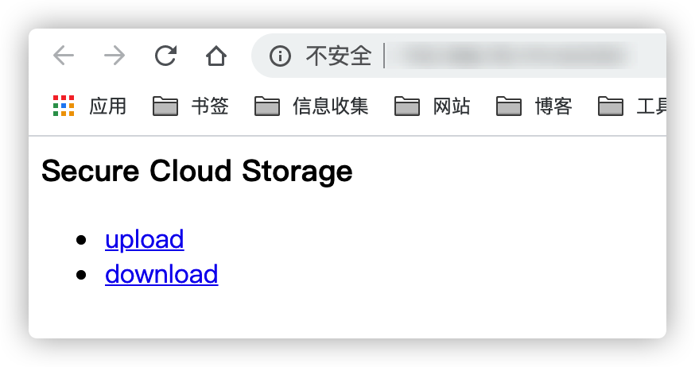
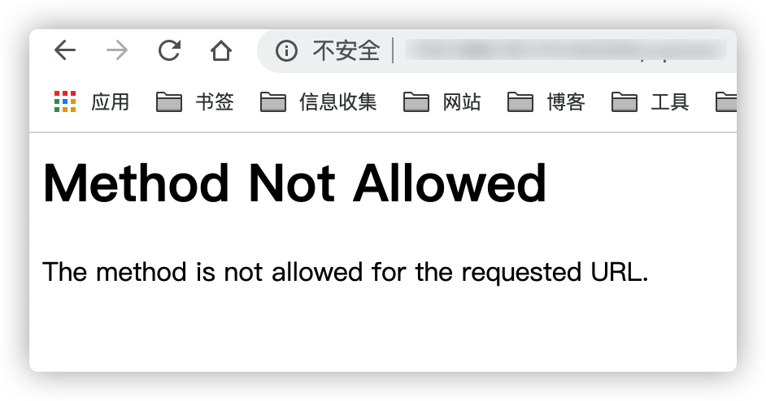
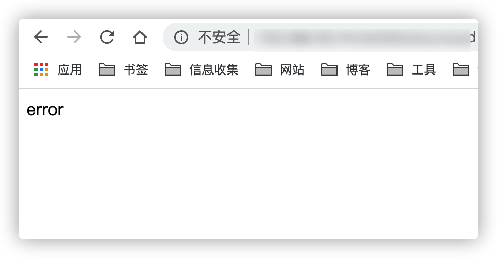
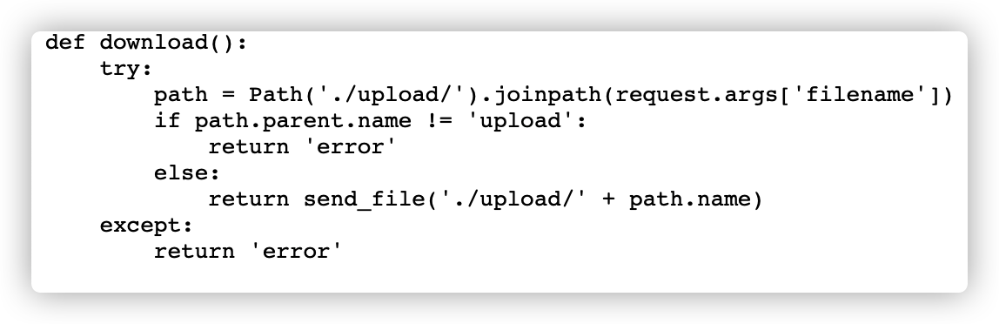
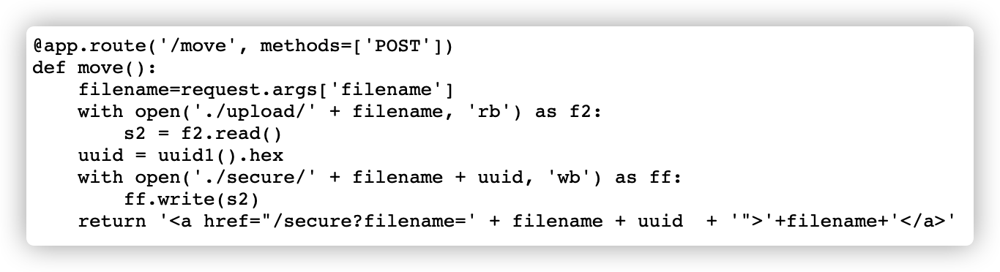
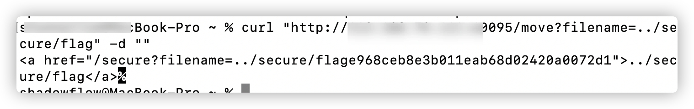
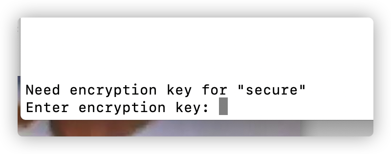
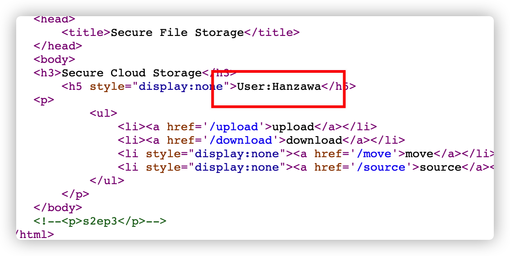
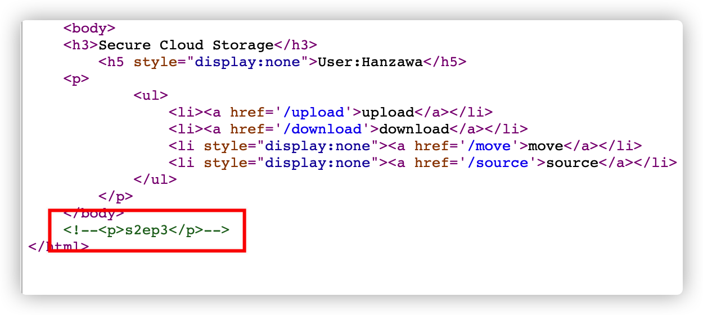
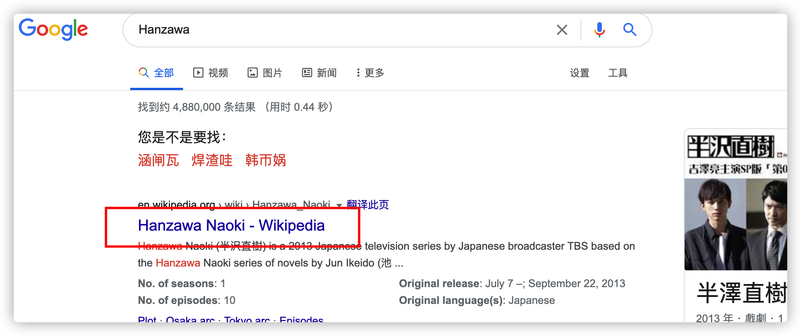

# CTF：从一道CTF爱上一部岛国片

最近和同事一起做了一道很有意思的CTF，这里分享一下


首先访问是这样的

 


分别点击upload,和download，一个显示方法错误，一个显示error

 

 

按照CTF的常规套路，查看源码，通过源码发现了源码文件source，访问之。

 

通过源码得知该站是用flask搭建的。源码有三个主要函数，一个upload()是上传用的，一个是下载文件download()一个move()是移动文件用的，还有一个secure()是访问文件的。在secure()函数里我们发现如下代码。


代码的意思是从url参数filename中获取文件名，和/secure进行拼接，然后把文件发送到前端。这里的if语句限定了文件只能是secure目录下的非flag文件。由此我们推断flag就在secure/flag里。

如何绕过非flag文件的限制呢？

继续查看源码，我首先想到的是通过download()函数来下载secure/flag。download()函数如下



看代码我们知道这里可以下载upload目录下的文件，但是如何下载secure目录下的文件了，用目录穿越？显然不行，因为代码`path.paren.name !='upload'`写死了。这就没办法了，另寻它路。再看源码，来到move函数



这个函数先从参数filename获取文件名，然后读取upload目录下的该读文件，在文件名后门拼接了uuid然后移动到secure目录下，也就是flag文件所在目录。移动完之后，还会返回移动后的文件路径。这里我们知道，filename参数是完全可控的也就是说，`f2.read()`读的文件我们完全可控，而且没有download里的路径限制。于是，这里我们构造一个目录../secure/flag，不就读到了flag文件了吗。但是我们要怎样来访问这个文件呢？根据move函数的逻辑，我们读取的flag内容会被加上uuid然后重新放到原文件夹，然后返回路径。也就是说返回的路径的文件就是flag文件。好，到这里我们读取到了flag文件。

这里有个小知识点。python中`request.args['filename']`是从GET获取参数，这里代码是发送post数据包，所以要改成post数据包，filename参数放在get请求中。



还有一个tips，python的flask，在本地可以使用如下代码就可以启动一个服务，方便测试。

```python
if __name__=="__main__":
	app.run(host='0.0.0.0',port=8081)
```

下载下来的文件打开如下，一脸懵逼。

 

 

这时候我们继续研究，从vimcrypt来看这个一个vim加密的文件，于是用vim打开。果然要输入密码，再次一脸懵逼，这密码怎么搞。



再次回到题目来找线索。在题目首页看见这个User，表示一脸懵逼啊，难道密码是Hanzawa？试了一下，不对。

 

继续看题目s2ep3是什么鬼东西？难道是密码？尝试了一下，也不对。陷入了深深的沉思之中。

 

one hundred years later............

我复制了Hanzawa到谷歌上，一看是一部岛国片，全名是：Hanzawa Naoki。难道密码是Naoki？还是不对。我他妈无语了。



one hundred years later............

突然灵感炸现

s2ep3难道是第二季第三集？感觉对了，就是的。

找到半岛直树第二季第三集，去磨了杯咖啡，在办公司悠闲的看起了片儿。


one hundred years later............

哎，发现个美女(这应该不是重点)

 

one hundred years later............

下面就是影片中破解出来的密码，于是开了的拿着这个密码去破解vim加密的文件。


Yes!  Get It!

话说这片儿里妹子不错，爱了爱了。