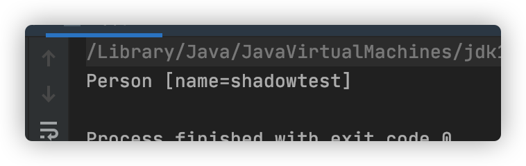

# 0x01 了解java反序列化

### **什么是java序列化？**

- 序列化：把Java对象转换为字节序列的过程。
- 反序列化：把字节序列恢复为Java对象的过程。

### **为什么要进行序列化？**

**1. 以面向对象的方式将数据存储到磁盘上的文件。**

举例：Web 服务器中的 Session 会话对象，当有10万用户并发访问，就有可能出现10万个 Session 对象，显然这种情况内存可能是吃不消的。于是 Web 容器就会把一些 Session 先序列化，让他们离开内存空间，序列化到硬盘中，当需要调用时，再把保存在硬盘中的对象还原到内存中。

**2. 在网络上传送对象的字节序列**

举例：我们知道，当两个进程进行远程通信时，彼此可以发送各种类型的数据，包括文本、图片、音频、视频等， 而这些数据都会以二进制序列的形式在网络上传送。同样的序列化与反序列化则实现了 进程通信间的对象传送，发送方需要把这个Java对象转换为字节序列，才能在网络上传送；接收方则需要把字节序列再恢复为Java对象。


# 0x02 如何实现序列化与反序列化

在Java中，如果一个对象要想实现序列化，必须要实现下面两个接口之一：

- Serializable 接口
- Externalizable 接口

### 2.1 Serializable 接口

一个对象想要被序列化，那么它的类就要实现Serializable接口或者Serializable的子接口。Serializable序列化接口没有任何方法或者字段，只是用于标识可序列化的语义。实现了Serializable接口的类可以被ObjectOutputStream转换为字节流，同时也可以通过ObjectInputStream再将其解析为对象。

这个对象的所有属性（包括private属性、包括其引用的对象）都可以被序列化和反序列化来保存、传递。不想序列化的字段可以使用transient修饰。

### 2.2 Externalizable 接口

它是Serializable接口的子类，用户要实现writeExternal()和readExternal() 方法，用来决定如何序列化和反序列化。因为序列化和反序列化方法需要自己实现，因此可以指定序列化哪些属性，而transient在这里无效。

### 2.3 序列化版本

在序列化过程中，可以控制序列化的版本。该字段为被序列化对象中的serialVersionUID字段。 一个对象数据，在反序列化过程中，如果序列化串中的serialVersionUID与当前对象值不同，则反序列化失败，否则成功。

```java
import java.io.Serializable;

public class User implements Serializable {
    private static final long serialVersionUID = 34324232342342L;
}
```

如果serialVersionUID没有显式生成，系统就会自动生成一个。生成的输入有：类名、类及其属性修饰符、接口及接口顺序、属性、静态初始化、构造器。任何一项的改变都会导致serialVersionUID变化。

Serializable接口没有定义任何方法，它是一个空接口。我们把这样的空接口称为“标记接口”（Marker Interface），实现了标记接口的类仅仅是给自身贴了个“标记”，并没有增加任何方法。当且仅当对象的类实现java.io.Serializable 接口时，该对象才有资格进行序列化。

JVM负责编写和读取可序列化对象的过程。序列化/反序列化功能通过对象流类的以下两种方法公开：

- ObjectOutputStream。writeObject（Object）：将可序列化的对象写入输出流。如果要序列化的某些对象未实现Serializable接口，则此方法将引发NotSerializableException。
- ObjectInputStream。readObject（）：从输入流读取，构造并返回一个对象。如果找不到序列化对象的类，则此方法将引发ClassNotFoundException。

如果序列化使用的类有问题，则这两种方法都将引发InvalidClassException，如果发生I / O错误，则将引发IOException。无论NotSerializableException和InvalidClassException是子类IOException异常。

### 2.4 举例

假设需要对Person对象进行序列化

```java
import java.io.Serializable;
public class Person implements Serializable {
    private static final long serialVersionUID = 8241970228716425282L;
    private String name;

    public String getName() {
        return name;
    }

    public void setName(String name) {
        this.name = name;
    }

    @Override
    public String toString() {
        return "Person [name=" + name + "]";
    }
}
```

然后，可以通过以下方式进行序列化和反序列化：

```
import java.io.FileInputStream;
import java.io.FileOutputStream;
import java.io.IOException;
import java.io.ObjectInputStream;
import java.io.ObjectOutputStream;
public class Test {
    public static void main(String[] args) {
        Person p = new Person();
        p.setName("shadowtest");
        writeObj(p);
        Person p2 = readObj();
        System.out.println(p2);
    }

    // 序列化
    public static void writeObj(Person p) {
        try {
            ObjectOutputStream objectOutputStream = new ObjectOutputStream(new FileOutputStream("/Users/shadowflow/code/a.txt"));
            objectOutputStream.writeObject(p);
            objectOutputStream.close();
        } catch (IOException e) {
            e.printStackTrace();
        }
    }

    // 反序列化
    public static Person readObj() {
        Person p = null;
        try {
            ObjectInputStream objectInputStream = new ObjectInputStream(new FileInputStream("/Users/shadowflow/code/a.txt"));
            try {
                p = (Person)objectInputStream.readObject();
            } catch (ClassNotFoundException e) {
                e.printStackTrace();
            }
        } catch (IOException e) {
            e.printStackTrace();
        }
        return p;
    }
}
```

最终，序列化的结果:


反序列化结果:



# 参考：

https://www.cnblogs.com/niceyoo/p/10596657.html

https://www.hetianlab.com/expc.do?ce=efa15bbe-8aab-4167-8d7b-6faac421de48

https://blog.csdn.net/qq_39390545/article/details/105104824

https://www.zhihu.com/question/47794528

https://www.cnblogs.com/feiqiangsheng/p/11077355.html